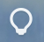

# SoundLamp

English | [日本語](README.md)

A tiny menu bar app that tells you at a glance whether your Mac's volume is really at zero.

- **Silent** (volume 0 or muted) → a regular icon (white in Dark Mode, black in Light Mode)
- **Sound is on** → a blue icon with a different shape

The icon just changes quietly. No blinking, no animation, no notifications, no sounds, no pop-ups.

## Screenshots

<!-- Images will live in docs/screenshots/ (see DESIGN_TODO.md). Uncomment once they are added.
| Silent | Sound on | Menu |
| --- | --- | --- |
|  |  |  |
-->

_Coming soon._

## Features

- Watches the default output device's volume and mute state with Core Audio listeners (no polling)
- Follows output device changes: AirPods, headphones, external displays, and so on
- Devices that don't expose a volume are treated as "sound on" unless muted
- From the menu:
  - Current state (e.g. "Silent (Volume 0)", "Sound is on (45%)") and the output device name
  - Set Volume to 0 (disabled when already 0; mutes devices whose volume can't be changed)
  - Launch at Login
- No Dock icon
- English and Japanese
- macOS 13 Ventura or later, Apple silicon and Intel (Universal)

## Install

1. Download the latest `SoundLamp-x.y.z.dmg` (or `.zip`) from [Releases](https://github.com/oyuaki/SoundLamp/releases)
2. Drag `SoundLamp.app` to your Applications folder
3. Open it as described below

### Opening an unsigned app

SoundLamp is ad-hoc signed, not signed with an Apple Developer ID or notarized, so macOS refuses to open it the first time. Use either of the following.

**Option A: Allow it in System Settings**

1. Double-click `SoundLamp.app` (dismiss the warning with "Done")
2. Open System Settings → Privacy & Security
3. Next to "“SoundLamp” was blocked…", click **Open Anyway**
4. Confirm with "Open Anyway" and enter your password

**Option B: Remove the quarantine attribute in Terminal**

```sh
xattr -dr com.apple.quarantine /Applications/SoundLamp.app
```

## Usage

After launch, the icon appears in the menu bar. Click it to see the state and the output device.
Turn on "Launch at Login" to start SoundLamp automatically (do this while the app is in the Applications folder).

## Building

Requirements: Xcode 16 or later, [XcodeGen](https://github.com/yonaskolb/XcodeGen)

```sh
brew install xcodegen
git clone https://github.com/oyuaki/SoundLamp.git
cd SoundLamp
xcodegen generate
open SoundLamp.xcodeproj
```

Build and test from the command line:

```sh
xcodegen generate
xcodebuild -project SoundLamp.xcodeproj -scheme SoundLamp -destination 'platform=macOS' test
```

Make a distributable build (Universal, ad-hoc signed, dmg/zip):

```sh
scripts/package.sh 1.0.0   # outputs to dist/
```

The detection logic (`Sources/SoundLampCore`) can also be tested as a Swift package without Xcode:

```sh
swift test
```

### Layout

| Path | Contents |
| --- | --- |
| `project.yml` | XcodeGen project definition |
| `App/` | Menu bar app (SwiftUI `MenuBarExtra`) |
| `Sources/SoundLampCore/` | Core Audio monitoring and detection logic |
| `Tests/SoundLampCoreTests/` | Unit tests, including device switching |
| `App/Assets.xcassets/` | App icon and menu bar icons (SF Symbols are used until images are added) |

## License

[MIT](LICENSE)
